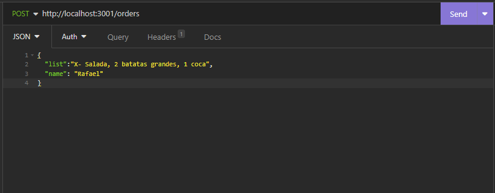
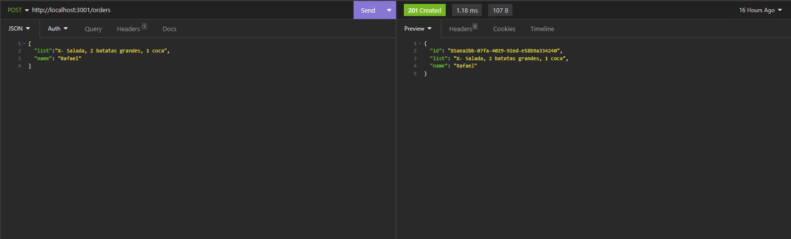
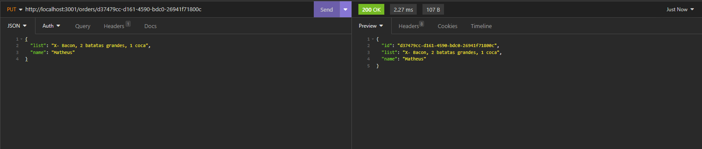
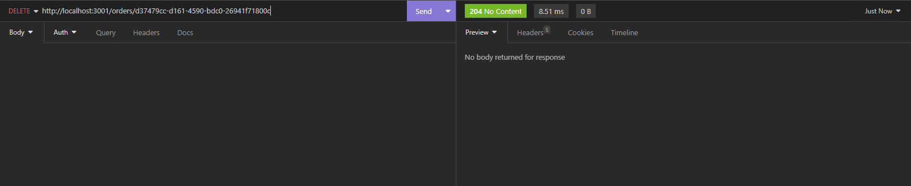

# Backend Code Burger

Esse projeto foi desenvolvido para gerenciar pedidos de uma hamburgueria. O backend foi construído utilizando Node.js, Express, uuid e cors.

## Instalação

1 - Clone o repositório em sua máquina local.
2 - Instale as dependências do projeto com o comando npm install (npm i).
3 - Inicie o servidor com o comando npm run dev. 

## Uso

Para utilizar use o Isominia para testar GET, POST, PUT e DELETE.

# GET

# POST
 
# PUT

# DELETE

## Contribuindo

Sinta-se à vontade para contribuir com o projeto enviando um pull request. Certifique-se de seguir os padrões de código e as boas práticas do projeto.

## Licença

[MIT](https://choosealicense.com/licenses/mit/)

## Contato

Caso tenha alguma dúvida ou sugestão sobre o projeto, por favor, entre em contato através do meu e-mail rafaelfaustrodrigues@gmail.com
